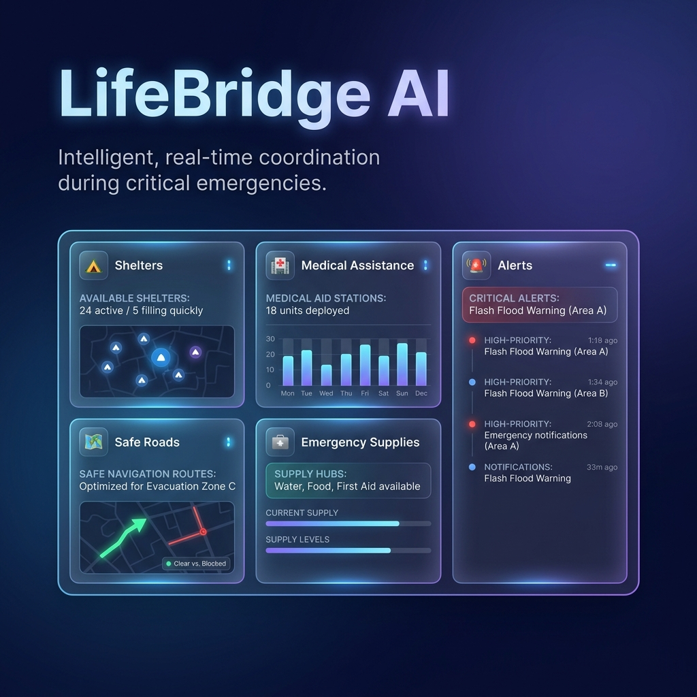
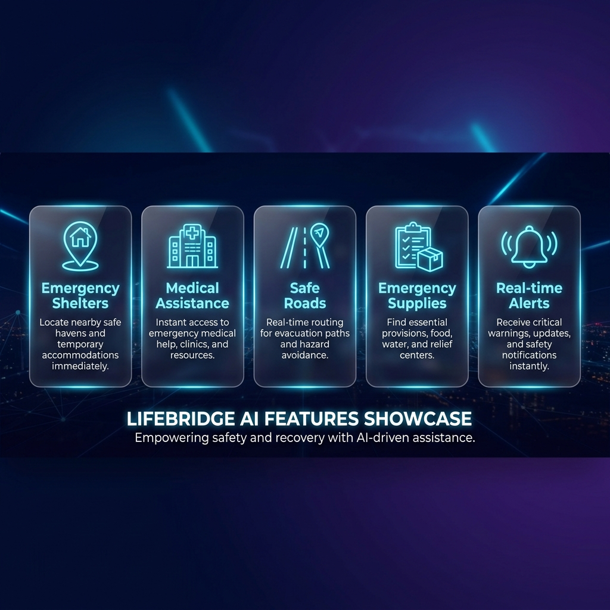
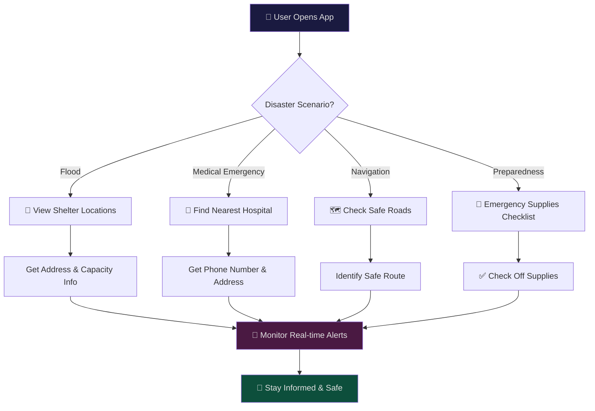
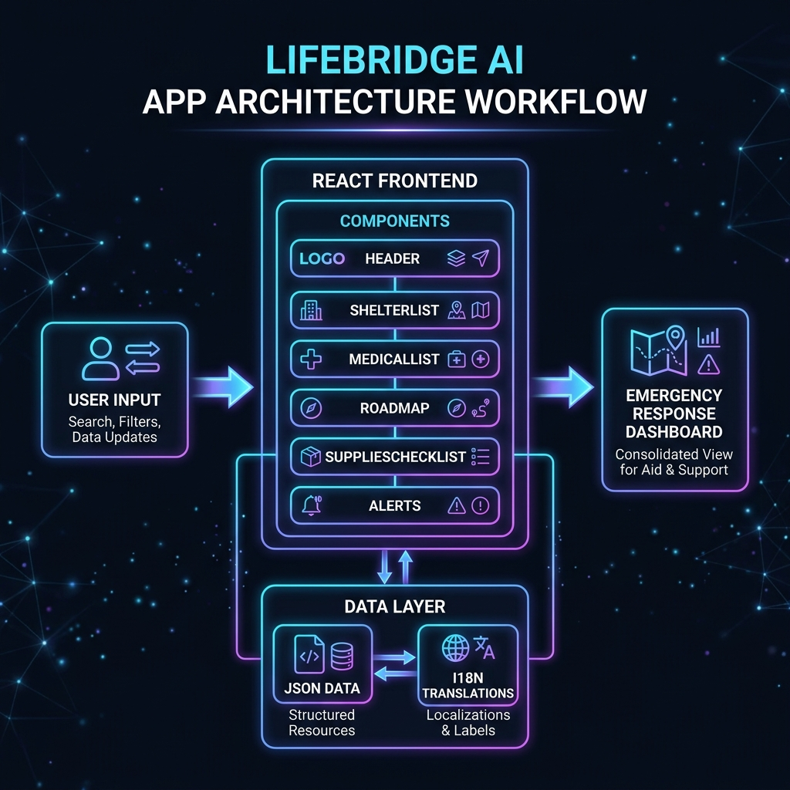
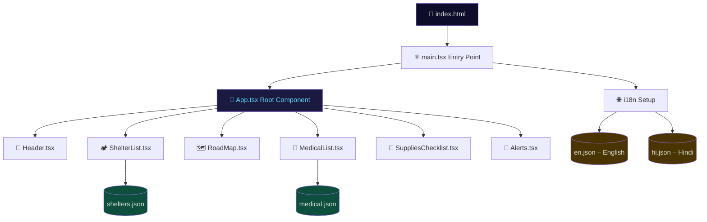
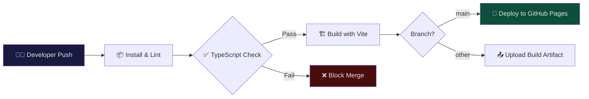
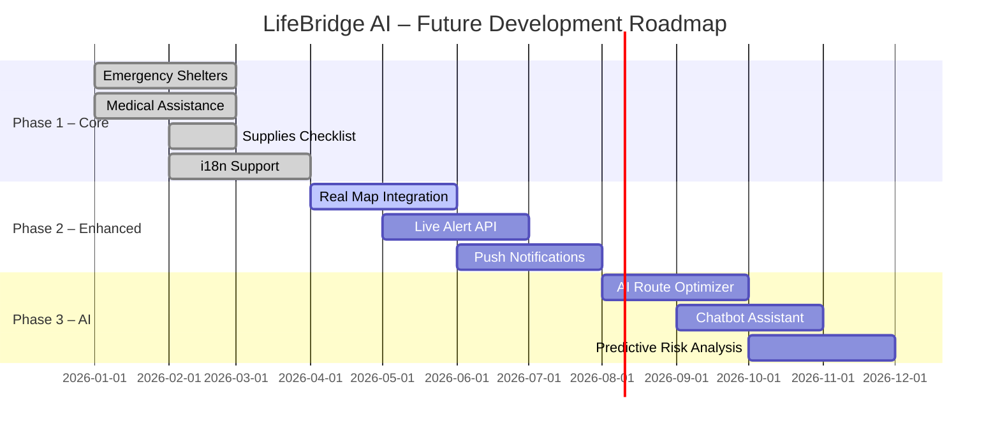

<div align="center">

  

  <h1>🚨 LifeBridge AI</h1>
  <h3>Your Intelligent Emergency Response Companion</h3>

  <p>
    
    
    
    
    
  </p>

  <p>
    <a href="https://github.com/aayush2411ghoghari-sketch/LIFEBRIDGE-AI/actions">
      
    </a>
    
    
    <a href="https://aayush2411ghoghari-sketch.github.io/LIFEBRIDGE-AI/">
      
    </a>
  </p>

  <p>
    <b>LifeBridge AI</b> is a modern, AI-powered emergency response web application that provides real-time guidance during disasters — floods, earthquakes, cyclones, and accidents. It connects people in crisis to shelters, medical facilities, safe routes, and emergency supplies instantly.
  </p>

</div>

---

## 📖 Table of Contents

- [🌟 Features](#-features)
- [🖼️ Screenshots & Workflows](#️-screenshots--workflows)
- [🏗️ Architecture](#️-architecture)
- [🚀 Getting Started](#-getting-started)
- [📁 Project Structure](#-project-structure)
- [🔄 CI/CD Pipeline](#-cicd-pipeline)
- [🌐 Internationalization](#-internationalization)
- [🛣️ Roadmap](#️-roadmap)
- [🤝 Contributing](#-contributing)
- [📄 License](#-license)

---

## 🌟 Features



| Feature | Description |
|---|---|
| 🏕️ **Emergency Shelters** | Locate nearest shelters with address and capacity information |
| 🏥 **Medical Assistance** | Find hospitals and clinics with direct contact numbers |
| 🗺️ **Safe Roads Map** | Interactive map placeholder for route navigation during disasters |
| 🎒 **Emergency Supplies Checklist** | Interactive checklist to track essential emergency supplies |
| 🔔 **Real-time Alerts** | Live alert panel for incoming disaster notifications |
| 🌍 **Multilingual Support** | Full i18n support with English and Hindi translations |
| 🎨 **Glassmorphism UI** | Stunning dark-mode UI with glassmorphism design system |

---

## 🖼️ Screenshots & Workflows

### Application Dashboard

The LifeBridge AI dashboard provides an at-a-glance view of all critical emergency resources in a beautiful glassmorphism layout:

```
┌─────────────────────────────────────────────────────────┐
│              🚨 LifeBridge AI Header                     │
│    "Your guide during floods, earthquakes & more"        │
├───────────────┬───────────────┬─────────────────────────┤
│  🏕️ Shelters  │  🗺️ Safe Roads │   🏥 Medical Assistance  │
│  ┌─────────┐  │  ┌─────────┐  │   ┌──────────────────┐  │
│  │Community│  │  │Map View │  │   │ City Hospital    │  │
│  │  Hall   │  │  │(future) │  │   │ Town Clinic      │  │
│  │Gymnasium│  │  └─────────┘  │   │ Village Health   │  │
│  └─────────┘  │               │   └──────────────────┘  │
├───────────────┴──────────┬────┴─────────────────────────┤
│  🎒 Emergency Supplies   │   🔔 Alerts                  │
│  ☐ Water (2L per person)│   No active alerts            │
│  ☐ Non-perishable food  │   Real-time alerts appear here│
│  ☐ First-aid kit        │                               │
│  ☐ Flashlight + battery │                               │
└──────────────────────────┴──────────────────────────────┘
```

### User Interaction Workflow



---

## 🏗️ Architecture



### Component Architecture



### Tech Stack

```
┌─────────────────────────────────────────────────┐
│                  LifeBridge AI                  │
├─────────────────┬──────────────┬────────────────┤
│   Frontend      │   Build Tool │  Styling       │
│   React 18.3    │   Vite 5.2   │  Vanilla CSS   │
│   TypeScript    │   SWC        │  Glassmorphism │
├─────────────────┴──────────────┴────────────────┤
│   Internationalization: react-i18next            │
│   Data: JSON files (shelters, medical)           │
│   Deployment: GitHub Pages via GitHub Actions    │
└─────────────────────────────────────────────────┘
```

---

## 🚀 Getting Started

### Prerequisites

- **Node.js** v18 or higher
- **npm** v9 or higher

### Installation

```bash
# 1. Clone the repository
git clone https://github.com/aayush2411ghoghari-sketch/LIFEBRIDGE-AI.git
cd LIFEBRIDGE-AI

# 2. Install dependencies
npm install

# 3. Start the development server
npm run dev
```

The app will be available at **http://localhost:5173**

### Build for Production

```bash
# Create optimized production build
npm run build

# Preview the production build locally
npm run preview
```

---

## 📁 Project Structure

```
LIFEBRIDGE-AI/
├── 📂 .github/
│   └── 📂 workflows/
│       └── 📄 ci-cd.yml          # GitHub Actions CI/CD pipeline
├── 📂 docs/
│   └── 📂 images/                # README assets
│       ├── 🖼️ hero_banner.png
│       ├── 🖼️ architecture.png
│       └── 🖼️ features.png
├── 📂 src/
│   ├── 📂 components/
│   │   ├── 🧩 Header.tsx          # App header with title & subtitle
│   │   ├── 🧩 Header.css
│   │   ├── 🧩 ShelterList.tsx     # Emergency shelter locations
│   │   ├── 🧩 ShelterList.css
│   │   ├── 🧩 RoadMap.tsx         # Safe roads map (placeholder)
│   │   ├── 🧩 RoadMap.css
│   │   ├── 🧩 MedicalList.tsx     # Medical facility finder
│   │   ├── 🧩 MedicalList.css
│   │   ├── 🧩 SuppliesChecklist.tsx  # Interactive supply tracker
│   │   ├── 🧩 SuppliesChecklist.css
│   │   ├── 🧩 Alerts.tsx          # Real-time alert panel
│   │   └── 🧩 Alerts.css
│   ├── 📂 data/
│   │   ├── 📊 shelters.json       # Shelter location data
│   │   └── 📊 medical.json        # Medical facility data
│   ├── 📂 i18n/
│   │   ├── 🌐 i18n.ts             # i18n configuration
│   │   ├── 🌐 en.json             # English translations
│   │   └── 🌐 hi.json             # Hindi translations
│   ├── 📂 styles/
│   │   └── 🎨 global.css          # Global design system & glassmorphism
│   ├── 🎯 App.tsx                 # Root component
│   └── 🚪 main.tsx                # Entry point
├── 📄 index.html                  # HTML entry point
├── 📄 package.json                # Dependencies & scripts
├── 📄 tsconfig.json               # TypeScript configuration
├── 📄 vite.config.ts              # Vite build configuration
└── 📄 .gitignore                  # Git ignore rules
```

---

## 🔄 CI/CD Pipeline

LifeBridge AI uses **GitHub Actions** for continuous integration and deployment.



### Pipeline Jobs

| Job | Trigger | Description |
|---|---|---|
| 📦 **Install & Lint** | All pushes & PRs | Installs deps, runs TypeScript type check |
| 🏗️ **Build** | After lint passes | Creates production Vite bundle |
| 🚀 **Deploy** | Push to `main` only | Auto-deploys to GitHub Pages |

---

## 🌐 Internationalization

LifeBridge AI supports multiple languages using **react-i18next**:

| Language | Code | Status |
|---|---|---|
| 🇺🇸 English | `en` | ✅ Complete |
| 🇮🇳 Hindi | `hi` | ✅ Complete |

To add a new language, create a JSON file in `src/i18n/` and register it in `src/i18n/i18n.ts`.

---

## 🛣️ Roadmap



### Upcoming Features

- [ ] 🗺️ **Interactive Map** – Leaflet.js / Google Maps integration for live route planning
- [ ] 🤖 **AI Chatbot** – Gemini AI-powered emergency assistant
- [ ] 🔔 **Push Notifications** – Real-time browser notifications for alerts
- [ ] 📡 **Live Alert API** – Integration with government disaster alert systems
- [ ] 📱 **PWA Support** – Offline-capable Progressive Web App
- [ ] 🌙 **More Languages** – Tamil, Telugu, Bengali, and more
- [ ] 📊 **Analytics Dashboard** – Resource usage statistics for authorities

---

## 🤝 Contributing

Contributions are warmly welcome! Please follow these steps:

1. **Fork** the repository
2. **Create** a feature branch: `git checkout -b feature/amazing-feature`
3. **Commit** your changes: `git commit -m 'feat: add amazing feature'`
4. **Push** to the branch: `git push origin feature/amazing-feature`
5. **Open** a Pull Request

### Commit Convention

We follow [Conventional Commits](https://www.conventionalcommits.org/):

| Prefix | Purpose |
|---|---|
| `feat:` | New feature |
| `fix:` | Bug fix |
| `docs:` | Documentation update |
| `style:` | UI/CSS changes |
| `refactor:` | Code refactoring |
| `chore:` | Maintenance tasks |

---

## 📄 License

This project is licensed under the **MIT License** – see the [LICENSE](LICENSE) file for details.

---

<div align="center">

  Made with ❤️ by **Aayush Ghoghari**

  *Bridging the gap between people and emergency resources with the power of AI*

  ⭐ **Star this repo** if LifeBridge AI helps you or inspires you!

  
  

</div>
