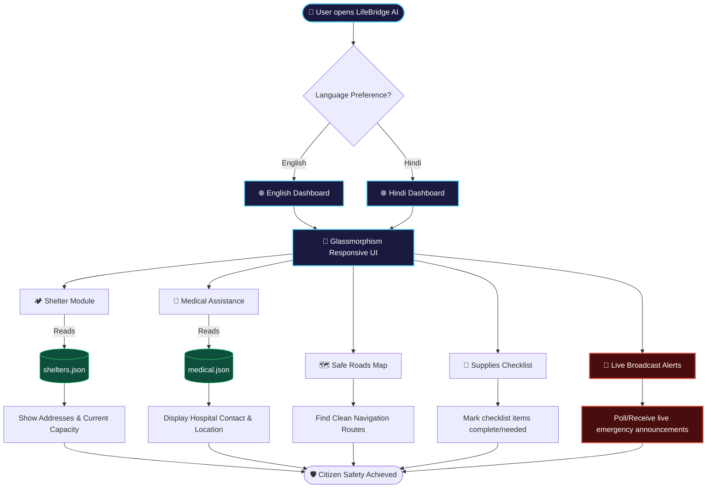

# LifeBridge AI - Project Description & Workflow

## Project Overview
**LifeBridge AI** is an intelligent, high-performance web-based disaster management and emergency response platform. Designed during critical conditions like floods, earthquakes, cyclones, and accidents, LifeBridge AI acts as a digital lifeline connecting affected citizens to nearby resources, emergency shelters, medical assistance, and real-time safe navigation options. 

Using modern frontend frameworks and responsive design systems, LifeBridge AI aims to replace cluttered interfaces with a clean, highly accessible, and visually reassuring environment built on glassmorphic aesthetics.

---

## Key Core Modules

1. **🏕️ Emergency Shelter Locator**
   - Direct connection to active shelter databases.
   - Real-time updates on remaining capacities and addresses.

2. **🏥 Medical Assistance Hub**
   - Active registry of hospitals, mobile clinics, and ambulance services.
   - Direct phone contact triggers for immediate relief.

3. **🗺️ Safe Road Navigation**
   - Live route analysis indicating road blocks, flooded streets, and safe pathways.
   - Designed to guide rescue teams and civilians during navigation.

4. **🎒 Emergency Supplies Checklist**
   - Interactive, state-persisted checklists enabling users to audit their disaster kits (e.g., water, first-aid, power banks).

5. **🔔 Real-time Broadcast Alerts**
   - Immediate system notifications for critical local updates.

6. **🌍 Multilingual Interface (i18n)**
   - Supports English and Hindi translations out of the box to maximize accessibility.

---

## System Architecture & Workflow

The diagram below details the end-to-end user navigation flow and system modules:

---

## Technology Stack

- **Framework**: React 18.3 (TypeScript)
- **Bundler**: Vite 5.2
- **Styling**: Pure CSS (Glassmorphic Design Tokens)
- **Localization**: React-i18next
- **Containerization**: Docker (Nginx Static Server)
- **Deployment**: Google Cloud Run & GitHub Pages
